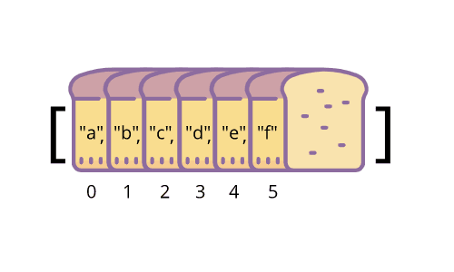
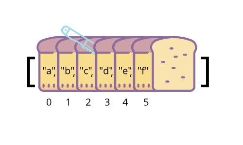
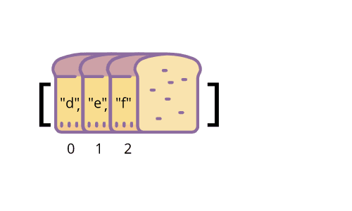
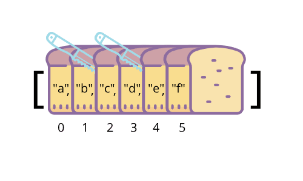
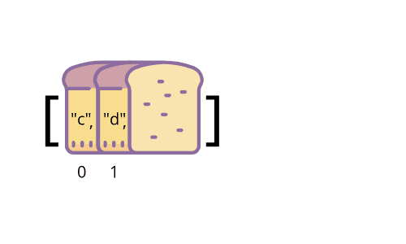
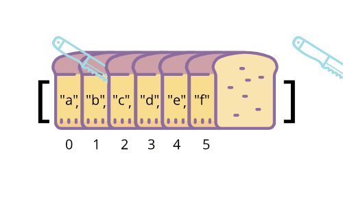
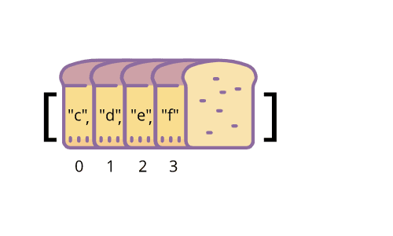
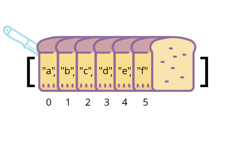

## Intro

Arrays have a variety of built in methods which can be quite powerful, but also very intimidating for beginners. In this post, we will break down the `Array.slice()` method into bite-sized pieces to help conquer a useful array method.

## Let's knead that bread

For this breakdown, we will be looking at the array `bread = ["a", "b", "c", "d", "e", "f"]`. You may be asking yourself:

> "Why are we assigning the array to a variable `bread`?"

The reason is that we will be using a loaf of bread as our mental image of the array, where each slice of bread is an element from our `bread` array and each comma is a point where we could cut our bread.



Note that the numbers below each element of the array are the index of that element.

## Sharpen your blade

With the `slice()` method, you are able to manipulate an array by indicating at which comma you would like to 'cut' your array. There are 3 scenarios we will be looking at with passing arguments into `slice()`.

### One Argument

When you pass one argument into `slice()`, you are indicating the point where you will slice your bread loaf. **The first argument will remove from the beginning of the array until the designated slicing point**. So by using `bread.slice(3)`, we are indicating that we would like to cut at the 3rd comma and remove everything before that comma.

```js{codeTitle: "Javascript"}
var bread = ["a", "b", "c", "d", "e", "f"];
var slicedBread = bread.slice(3);

// slicedBread is ["d", "e", "f"]
```

Slicing:


slicedBread:


### Two Arguments - Both less than array length

When passing two arguments to `slice()`, the first argument works the same as when passing one argument, but what about the second argument? **The second argument also indicates the comma where you would like to cut your bread, but this time instead of removing what comes before that comma, we remove what comes after that comma.** So if we use `bread.slice(2,4)`, we are cutting our bread at the second comma and fourth comma and discarding everything not between those cut points.

```js{codeTitle: "Javascript"}
var bread = ["a", "b", "c", "d", "e", "f"];
var slicedBread = bread.slice(2, 4);

// slicedBread is ["c", "d"]
```

Slicing:


slicedBread:


### Two Arguments - 2nd argument larger than array length

What if we were to pass in something large as the second argument like 100? Well, that would be like counting out 94 invisible/non-existent pieces of bread and cutting at that point - **It will work the same as passing in a single argument!**

```js{codeTitle: "Javascript"}
var bread = ["a", "b", "c", "d", "e", "f"];
var slicedBread = bread.slice(2, 100);

// slicedBread is ["c", "d","e", "f"]
```

Slicing:


slicedBread:


### Other ways to slice it

#### 0 as an argument

When you pass in 0, that's the equivalent of slicing the air before your bread - **it does nothing**.

```js{codeTitle: "Javascript"}
var bread = ["a", "b", "c", "d", "e", "f"];
var slicedBread = bread.slice(0);

// slicedBread is ["a", "b", "c", "d", "e", "f"]
```



#### First argument >= Second argument

When you pass in the same argument (`bread.slice(4,4)`) or the second argument is smaller than your first argument (`bread.slice(4,2)`) the same rules as above apply, you cut and discard everything before the first argument, then cut and discard everything after the second argument. **This will always result in an empty array**.

## Closing

Hopefully this analogy helps clear up any confusion around `Array.slice()` and makes arrays easier to understand moving forward. If you have any questions about arrays or the slice method, feel free to [tweet at me](https://twitter.com/terabytetiger)!
