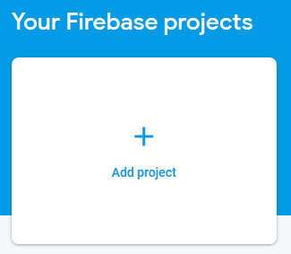
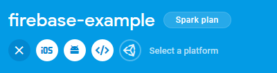
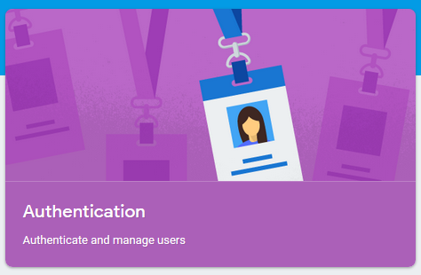
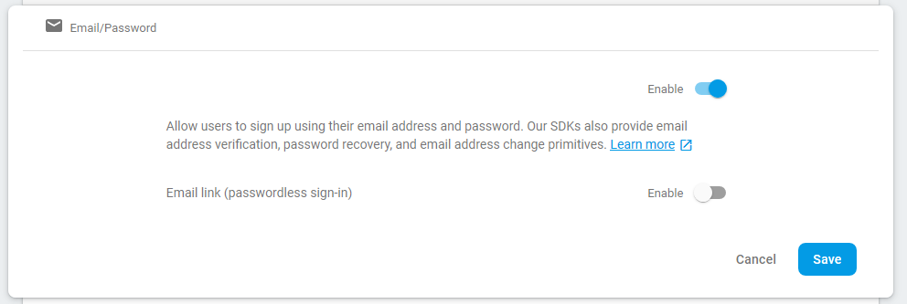
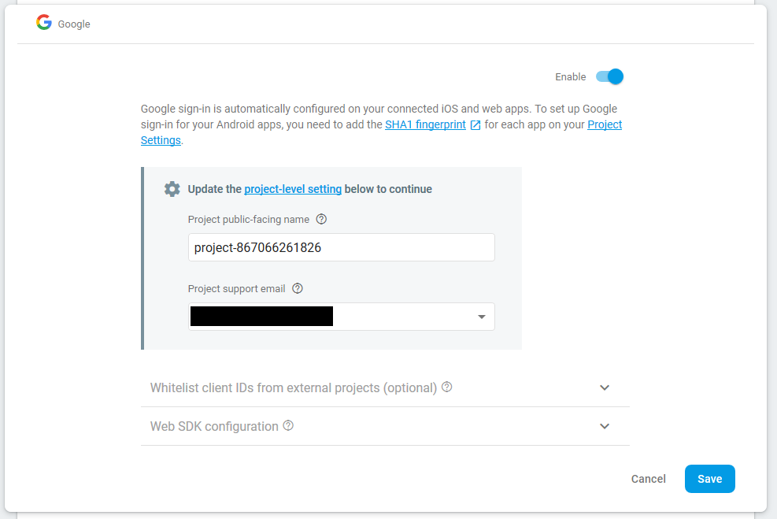
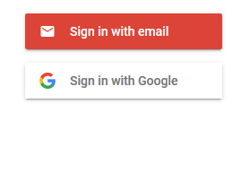

_Note: I am not a Firebase affiliate_

## What is Firebase?

[Firebase](https://firebase.google.com/) is a collection of tools provided by Google including tools such as cloud databases, authentication, hosting, and serverless functions for use with web and mobile apps. One of the appeals of Firebase is the ability to get started with the free tier plan and only need to pay once your project hits certain usage numbers.

In this post, I'll walk through an example of Firebase web authentication.

## Creating a project

A "Project" is how Firebase refers to your website/app and the connections back to Firebase's services. From [firebase.google.com](https://firebase.google.com), you can sign in (top right) and click "Go to console" (also top right corner).

### The Console

The console is the place where all your projects live. Once you've added projects to your account, they will appear here. Selecting a project card will take you to the dashboard for that project - that's where you'll adjust settings for your project.

### Add a new Firebase Project

Adding a project is a very quick process. Click the "Add Project" card, add your project name, adjust the location if needed, and accept the terms & conditions (after reading them, of course) - That's it!



### A note on free projects

It's probably a good time to mention that each project gets its own plan, so you don't have to worry about your projects compounding to break past the free tier limits (although there is a limit on quantity of free projects allowed - [More Details](https://firebase.google.com/support/faq)).

## Connecting our webpage

Before we can use Firebase's services, we have to create a link between our page and Firebase. To do this, click the icon that looks like an html closing tag (third white-background icon from the left):



Here, you'll add your app's nickname (this can be anything) and add hosting if you'd like (including hosting allows you to deploy your website through Firebase - I won't be covering hosting in this article, so I left this unchecked).

Once you click "Register app", you'll be provided an HTML code block and instructions to add this to the end of your `<body>` (but before trying to use Firebase).

I'll be adding this to a boilerplate HTML file (`index.html`):

**Note that you'll need to add the provided firebaseConfig object values**

```html
<!DOCTYPE html>
<html lang="en">
    <head>
        <meta charset="UTF-8" />
        <meta name="viewport" content="width=device-width, initial-scale=1.0" />
        <meta http-equiv="X-UA-Compatible" content="ie=edge" />
        <title>Firebase Example</title>
    </head>
    <body>
        <div id="firebaseui-auth-container">
            <!-- This is where the Login ui will load -->
        </div>
        <!-- The core Firebase JS SDK is always required and must be listed first -->
        <script src="https://www.gstatic.com/firebasejs/6.3.3/firebase-app.js"></script>

        <!-- TODO: Add SDKs for Firebase products that you want to use
    https://firebase.google.com/docs/web/setup#config-web-app -->
        <script src="https://www.gstatic.com/firebasejs/6.3.3/firebase-auth.js"></script>
        <script>
            // Your web app's Firebase configuration
            var firebaseConfig = {
              REPLACE THIS WITH THE CODE PROVIDED BY FIREBASE
            };
            // Initialize Firebase
            firebase.initializeApp(firebaseConfig);
        </script>
    </body>
</html>
```

### What does the Firebase Code Snippets do?

This block loads Firebase by importing it from a Content Delivery Network (CDN for short), similar to if you've ever used jQuery or Bootstrap.

```html
<!-- The core Firebase JS SDK is always required and must be listed first -->
<script src="https://www.gstatic.com/firebasejs/6.3.3/firebase-app.js"></script>
```

This block will be replaced with additional services that you want your page to load. In this example, we are only loading the authentication services:

```html
<!-- TODO: Add SDKs for Firebase products that you want to use
https://firebase.google.com/docs/web/setup#config-web-app -->
<script src="https://www.gstatic.com/firebasejs/6.3.3/firebase-auth.js"></script>
```

Finally, this block provides the details to Firebase, creating a connection back to your project. This works like caller ID - when someone calls you, you might not want to talk about your car's extended warranty so you'd only answer if the caller was someone you know.

```html
<script>
    // Your web app's Firebase configuration
    var firebaseConfig = {
      REPLACE THIS WITH THE CODE PROVIDED BY FIREBASE
    };
    // Initialize Firebase
    firebase.initializeApp(firebaseConfig);
</script>
```

---

This creates the baseline connection for our app to Firebase. Next we will enable authentication and add the Firebase Authentication Web UI to our page!

## Authentication

Many apps want to leverage the power of an authentication system, but trying to sort out connections to various services _and_ allowing an email login can be a lot of work. Thankfully, Firebase takes a lot of the work out of your hands and allows you to easily start with one service and add in additional services over time.

### Enable Authentication

To enable authentication, click the Authentication card or select "Authentication" from the left hand navigation, then "Set up sign-in method" once the page loads. This is where you can configure providers you would like users to be able to sign in with.



For this tutorial, we'll be setting up Email/Password and Google account logins.

#### Email/Password

The most basic sign in option, this allows users to use their email/password to sign up/in. Enabling this is as easy as flipping the first toggle switch after clicking "Email/Password" from the Sign-In providers list, then clicking "Save".



#### Google Account Sign In

This will allow users to sign in with their Google account (similar to how you signed into Firebase). Similar to Email/Password, you'll be able to flip the enable switch to "Enabled", but there is an extra step here. You'll need to add a support email, which needs to be a valid Gmail account. This is the email account that will be accessible to end users to contact in case of a support issue, so keep that in mind before setting your personal account as the support contact.



#### Other options

For external services, details on connecting to providers can be found in the corresponding docs (linked here):

-   [Facebook](https://firebase.google.com/docs/auth/web/facebook-login)
-   [Twitter](https://firebase.google.com/docs/auth/web/twitter-login)
-   [GitHub](https://firebase.google.com/docs/auth/web/github-auth)
-   [Microsoft](https://firebase.google.com/docs/auth/web/microsoft-oauth)
-   [Yahoo](https://firebase.google.com/docs/auth/web/yahoo-oauth)
-   [Phone Number](https://firebase.google.com/docs/auth/web/phone-auth)

## Authentication UI

Now that we have our connection setup to talk to Firebase, we need to add the interface for the user. I'll be using [Firebase UI](https://github.com/firebase/firebaseui-web) for this, which involves adding the following after our Firebase initialization block:

```diff
      // ...
      // Initialize Firebase
      firebase.initializeApp(firebaseConfig);
    </script>
    <!-- Firebase UI -->
+    <script src="https://cdn.firebase.com/libs/firebaseui/3.5.2/firebaseui.js"></script>
+    <link
+      type="text/css"
+      rel="stylesheet"
+      href="https://cdn.firebase.com/libs/firebaseui/3.5.2/firebaseui.css"
+    />
+    <script src="./auth.js"></script>
  </body>
</html>
```

These additions will load the Firebase UI information we need, but we need to tell it what configuration to use (this is where the `auth.js` file comes in).

### Auth.js

First, we'll need to create `auth.js` in the same directory as our `index.html` file.

Within `auth.js`, we will be adding the following:

```javascript
// 1) Create a new firebaseui.auth instance stored to our local variable ui
const ui = new firebaseui.auth.AuthUI(firebase.auth());

// 2) These are our configurations.
const uiConfig = {
    callbacks: {
        signInSuccessWithAuthResult(authResult, redirectUrl) {
            return true;
        },
        uiShown() {
            document.getElementById("loader").style.display = "none";
        },
    },
    signInFlow: "popup",
    signInSuccessUrl: "signedIn",
    signInOptions: [
        firebase.auth.EmailAuthProvider.PROVIDER_ID,
        firebase.auth.GoogleAuthProvider.PROVIDER_ID,
        // Additional login options should be listed here
        // once they are enabled within the console.
    ],
};

// 3) Call the 'start' method on our ui class
// including our configuration options.
ui.start("#firebaseui-auth-container", uiConfig);
```

Now, if you open your `index.html` file in your browser, you should see the following loading on the page:



🎉 Congrats! You've got an authentication UI ready to use! (Although it won't work until it's on a server; i.e. if you configured firebase hosting earlier)

[Example Github Repository](https://github.com/12vanblart/firebase-example)
