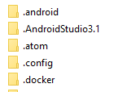
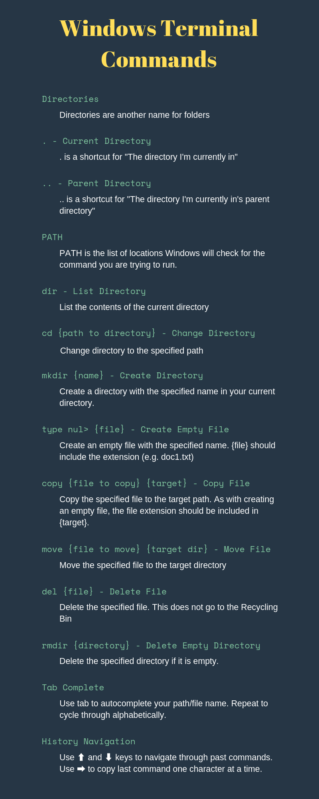

[Jump to the Infographic summary!](#infographic-summary-a-nameinfographica)

## Intro

The terminal is a mysterious and scary place, especially for new developers. Even after a semester-long class on servers, I was still feeling uneasy in terminals - Especially Windows, since it felt like every command we had learned to rely on in the class didn't work (since everything in class was for BASH - Bourne-again Shell). In this post, I want to provide an intro to the Windows Terminal that I wish I had so that you hopefully don't have to feel as afraid of the terminal for as long as I did.

## Terminology

### Directories

"Directories" is the fancy name for folders. When you open File Explorer, all the little folder icons are your directories.



While navigating through directories, there are two special shortcut directories indicated by `.` and `..`.

#### . - Current Directory

`.` is the shortcut for the current directory. You may see this when building websites in the CSS or JavaScript import statements:

```html {codeTitle: "index.html"}
<link href="./style.css" rel="stylesheet" type="text/css">
<script src="./javascriptFile.js">
```

#### .. - Parent Directory

`..` is a shortcut for saying "My Parent directory" and can be used to "jump" across folders when importing files in HTML:

_In this example, we are pretending we have folders labeled `html`, `css`, and `javascript` where files get placed according to type_

```html {codeTitle: "index.html"}
<link href="../css/style.css" rel="stylesheet" type="text/css">
<script src="../js/javascriptFile.js">
```

### PATH

If you enter the command `echo %PATH%`, you'll see a semi-colon delimited list of file paths, each (probably) looking something like `C:\Program Files\Program Name\` or `C:\WINDOWS\system32\`. This is your **Path Environment Variable** - aka the list of places to check for a command.

Whenever you call a command, Windows needs to know what that command does - so it starts looking through the Path variable until it finds the command you are trying to call.

You can think of it as a line of boxes and you need to find something in one of the boxes. You'll start going through one box at a time until you find the thing you're looking for (at which point you would stop looking). This is important in the case that you have multiple instances of the same command (i.e. if you have VS Code and VS Code Insiders, using `code .` will always trigger whichever is listed first in your path).

If you wanted to run a command in your current directory, but that is also in your path, you can target the current directory's version by using `.\targetCommand.exe` (File extension will vary).

## Commands

### Navigation

The most important part of living in the terminal is being able to get around! The two commands I use most often are:

#### dir

`dir` is the equivalent of looking for the nearest street sign, but also noticing the houses on the street. When you run this command, Windows will let you know where you're at and what's around you - aka in your current directory. You should see something like this:

```{codeTitle: "Terminal"}
Volume in drive C is OS
Volume Serial number is 12AC-12A6

Directory of {{ Your Location }}
07/16/2019  12:05 PM    <DIR>          .
07/16/2019  12:05 PM    <DIR>          ..
06/04/2019  02:08 PM    <DIR>          public
07/04/2019  10:44 AM               522 README.md
07/04/2019  10:48 AM             1,459 package.json
               2 File(s)         1,981  bytes
               3 Dir(s)  315,250,264,546 bytes free
```

The key thing to note here:

-   The `<DIR>` in the third column indicates if an entity is a directory.
-   The fourth column is the file size in bytes (only files have this number)
-   Our friends `.` and `..` are here as well!

#### cd

So now we know what directory we are in, but how do we move?

Enter `cd` - short for "Change Directory" - followed by the path of the directory you want to move to.

Examples:

```{codeTitle: "Terminal Commands"}
cd ..                           // Move to the parent directory

cd .\public                     // Move to the public folder

cd ..\..                        // Move to the parent directory's parent

cd ..\Desktop\Documents\Folder  // Move to the parent directory
                                // then a directory "Desktop" in that
                                // parent directory.

```

### Create a Directory

**Command:** `mkdir subfolder`

This will create a directory named "subfolder" (you can use any name) in your current directory. When you run this command, don't forget that you will need to `cd` into it (you aren't automagically taken there).

### Create File

**Command:** `type nul > doc1.txt`

If you ever see a tutorial reference `touch filename.txt`, this is the equivalent command in Windows. What happens is an empty file is created with the name "doc1.txt" (or whatever filename + extension you provide).

Something I often forget is to include the file extension 🙃

_Thanks to [@nicolaerario](https://dev.to/nicolaerario) for pointing out that `echo .` will create a blank line and that `type nul` is the correct start of this command!_

### Copy

**Command:** `copy doc1.txt doc2.txt`

This command will create a copy of the first file provided with the second file name (& optionally location). In the above example, doc1.txt will be copied into doc2.txt.

You can also specify a location with either argument:

```{codeTitle: "Terminal Commands Example"}
copy index.html .\public\index.html         // This creates a copy of index.html in
                                            // the public subfolder named index.html

copy ..\Desktop\file1.txt .\public\test.txt // Copy file 1.txt from the
                                            // Desktop folder's file1.txt into
                                            // the current directory's public subfolder
                                            // with the name test.txt

```

### Move

**Command:** `move doc1.txt .\subfolder`

Move let's you move a specified file into a specified directory. In this example, doc1.txt is being relocated into a subfolder named "subfolder". You may have noticed that this time I specified `.\subfolder` instead of just `subfolder`. You don't need to include the `.\`, but I tend to whenever I"m referencing a directory so that I can more easily find the command again if needed (more on this below under "History")

Example:

```{codeTitle: "Terminal Commands Example"}
move index.html public     // Move index.html into the public subfolder

move index.html ../Desktop // Move index.html to the parent directory's
                           // Desktop directory
```

### Delete Files

**Command:** `del doc3.txt`

_Everyone's favorite thing to do: Take out the trash!_

`del` is similar to highlighting the file in file explorer and pressing delete. In the above example, we are deleting doc3.txt from the current directory.

You can also chain delete commands:

```{codeTitle: "Terminal Commands Example"}
del doc1.txt doc2.exe doc3.js  // Delete doc1.txt, doc2.exe, and doc3.js

del *.txt                      // Delete all files in the current directory
                               // with the .txt extension
```

**Note that this does not send the files to the Recycling Bin and will not work on Directories**

### Delete (Empty) Directories

**Command:** `rmdir subdirectory`

`rmdir` will let you delete a specified directory, **but only if the directory is empty**. If the directory is not empty, the command will throw an error letting you know.

There is a way to tell rmdir to delete a non-empty directory, but I would recommend using the file explorer for safety (or use `del` to clear the directory manually, then use `rmdir`).

```{codeTitle: "Terminal Commands Example"}
rmdir sub  // Delete the empty sub-directory 'sub' from the current directory
```

### Tab Complete

One of the most useful Command-Line tricks is using tab to save you having to type the name of your file/directory.

For example, if you have `C:\Desktop\User\directory-name\reallyLongFileNameYouDontWant2Type.txt` you can use the following keystrokes:

```{codeTitle: "Terminal Tab Complete Example"}
C:\D{tab}\U{tab}\dir{tab}\reall{tab}

// At this point you should see
// C:\Desktop\User\directory-name\reallyLongFileNameYouDontWant2Type.txt
// if all the directories and files exist
```

**NOTE:** If you press tab, the first result alphabetically will be returned. You can press tab repeatedly to cycle through all autocompletes (when it hits the end of the list, it will restart at the beginning again).

_Shift + Tab will cycle in the opposite direction_

### History

If you are entering the same command as previously entered (or want to use a past command as a starting/reference point) you can use the ⬆ key and ⬇ key to navigate through your past commands.

Similarly, if you press the ➡ key, you can pull in your last command one character at a time.

## Closing

Now you've got everything you need to get going on the command line 😄

If you have any questions, I'm more than happy to help!

## Infographic Summary

Here's a summary of the commands in an Infographic:


