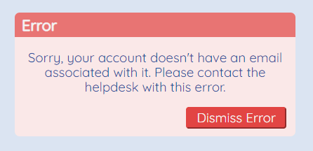

When building an application for your users, a common piece of functionality to include is a way to tell the user something went wrong, and preferably in a way they can determine what happened (or perhaps more accurately - what didn't happen).

For a recent work project, I decided to try and handle errors with Vuex in a way inspired by [flash messages](https://medium.com/@justinskord/implementing-flash-messages-to-your-website-64775b7552e2). I was happy with the outcome and thought I'd share! Enjoy! 🌮

## Prerequisites 📚

I'm going to be writing with the assumption that you have a base understanding of Vue's Single File Components and Vuex. If you want a detailed intro to Vuex, I think this post covers things nicely: [When why and How to use Vuex](https://dev.to/napoleon039/when-why-and-how-to-use-vuex-9fl) by [Nihar Raote](https://twitter.com/napoleon039)

## Setup 🔨

There are 3 files that we need to make sure are setup to handle:

1. Storing our error (State files)
2. Displaying our error (Vue Components/Layouts)

In our store, we want to setup the following state which will allow us to log our error so that it can be displayed throughout the application:

```js{codeTitle: "store/index.js"}
import Vue from "vue";
import Vuex from "vuex";

Vue.use(Vuex);

export default new Vuex.Store({
  state: {
    error: "",
  },
});
```

Next, we'll need to create a small component to display the error. I created my error message as a "toast" style with a fade-in and fade-out transition with a button to dismiss the error once the user is finished with it.

```html{codeTitle: "/src/components/ErrorMessage.vue"}
<template>
  <transition name="fadeAway">
    <div class="card errorMessage" v-if="this.$store.state.error">
      <h2 class="card-title">
        Error
      </h2>
      <p class="p-left p-right">
        
        {{ this.$store.state.error }}
        
      </p>
      <div class="card-actions">
        <button
          class="dismiss btn-red"
          @click.prevent="dismiss"
          aria-label="Dismiss Error"
        >
          Dismiss Error
        </button>
      </div>
    </div>
  </transition>
</template>

<script>
  export default {
    name: "ErrorMessage",
    methods: {
      dismiss() {
        this.$store.state.error = "";
      },
    },
  };
</script>

<style scoped>
  /* Not the cleanest CSS I've ever written - trying to loop my extra helper classes into as minimal css as possible 🍻*/

  .card {
    background: hsl(0, 80%, 95%);
    margin-top: 15px;
    margin-left: auto;
    margin-right: auto;
    border-radius: 7px;
    padding: 0 0 5px;
    text-align: center;
  }

  .card-title {
    text-align: left;
    background-color: hsl(0, 80%, 70%);
    margin: 0;
    border-radius: 7px 7px 0 0;
    color: #f3f3f3;
    padding: 5px 10px;
    font-size: 1.17em;
  }

  .card-actions {
    text-align: right;
    padding-right: 1rem;
    padding-bottom: 0.5rem;
  }

  .card-actions > button {
    padding: 0.2rem 1rem;
  }

  .btn-red {
    background-color: #eb4747;
    border-color: #eb4747;
    color: #f3f3f3;
    border-radius: 4px;
  }

  .fadeAway-enter-active {
    transition: all 0.3s ease;
  }

  .fadeAway-leave-active {
    transition: all 0.8s cubic-bezier(1, 0.5, 0.8, 1);
  }

  .fadeAway-leave-to,
  .fadeAway-enter {
    opacity: 0;
    transform: translateX(100px);
  }

  .errorMessage {
    position: fixed;
    right: 50px;
    bottom: 50px;
    max-width: 400px;
    min-width: 200px;
  }
</style>
```

In the event of an error, the user should see [something like this codepen](https://codepen.io/Pichuplayer/pen/vYOBdRq) (font import not included above):


Finally, the last bit of setup work is to include your Error Message component in your `App.vue` file:

```html{codeTitle: "src/App.vue"}
<template>
  <div id="app">
    <ErrorMessage />
    <router-view />
  </div>
</template>

<script>
  import ErrorMessage from "@/components/Layout/ErrorMessage.vue";

  export default {
    components: { ErrorMessage },
  };
</script>
```

## Setting an Error message 🚨

Now we've got our application setup to display and store the error - so how do we set the error?

### Within a component:

When you're within a component's lifecycle hooks or methods, you can set the value of our error with `this.$store.state.error = "Your error message here"`.

For example, I have a piece that checks if the user has an email on their profile - and throws an error if they don't:

```js{codeTitle: "LoginPage.vue"}
if (this.$auth.profile.email) {
  // ...
} else {
  this.$store.state.error =
    "Sorry, your account doesn't have an email associated with it.";
}
```

### Within State:

If you'd prefer to create `actions` and `mutations` for your state, you can update your state from above to look like this:

```js{codeTitle: "store/index.js"}
export default new Vuex.Store({
  state: {
    error: "",
  },
  mutations: {
    POST_ERROR: (state, payload) => {
      state.error = payload;
    },
  },
  actions: {
    SET_ERROR: (context, errorMsg) => {
      context.commit("POST_ERROR", errorMsg);
    },
  },
});
```

then you can use `mapActions` in your component to call your action:

```js{codeTitle: "Component.vue"}
{
// ...
methods: {
  ...mapActions(["SET_ERROR"]),
  checkEmail() {
    if(userHasEmail) {
      //...
    } else {
      this.SET_ERROR("Sorry, your account doesn't have an email associated with it.")
    }
  }
}
// ...
}
```

### From a store module:

In the process of code splitting my store into modules, I realized I would need a way to set the state's `error` value from the module in the event of an error. Vue has a great way to handle this in that any `action` function's `context` argument contains the ability to access parent state!

Within any module's action, you can reference parent state with `rootState` such as:

```js{codeTitle: "vuexModule.js"}
context.rootState.error = "There was an error! 🚨🚨🚨";
```

## Where to go from here 🚀

While this is one way to implement this, something you may have noticed is that this will only ever display a single error. It also requires the user to dismiss it, which may not be appropriate depending on your application.

If you're intrigued by this implementation, I'd encourage you to start tweaking it to fit your needs!
