## What is Gravit.io? 💭

[Gravit.io](https://gravit.io) is a browser-based vector graphics software - meaning it allows you to create images using lines, curves, and shapes similar to [Adobe Illustrator](https://www.adobe.com/products/illustrator.html) or [Affinity Designer](https://affinity.serif.com/en-us/designer/). Unlike those alternatives, however, Gravit offers a **free** tier and runs completely in your browser (or offline as a PWA with the PRO license). The included cloud storage combos nicely with being browser-based to allow you to start a project on one computer and seamlessly continue working on another computer later - a feature I use all too often.

Some things I've done with Gravit:

- All images in [this post](https://dev.to/terabytetiger/arrays-any-way-you-slice-it-1lfl) including the cover image
- Creating SVGs for my Twitch overlays
- Designing [Vueveloper merch](https://www.amazon.com/dp/B08DJLWG75)

## Useful Keyboard Shortcuts ⌨

From my time working with vector software, there are a few keyboard 'shortcuts' that I use a lot -

- `Shift` + Rotating = This locks your rotation to breakpoints, which helps keep rotations consistent across your work
- `Shift` + Scaling = This will scale your object at a 1:1 scale, which is useful for not causing distortions
- `alt` + drag object = This creates a duplicate of the object wherever you stop dragging
- Scroll wheel click + drag = This will allow you to pan around the canvas, which I find more convenient than trying to scroll the page
- `Ctrl` + Scroll = Zoom in/out, the same as your browser. The trick with this one is to make sure you're focused on the canvas so that the browser and sidebar don't scale instead! 😅

## How do Layers work? 👀

One of the common struggles I see with vector software is with Layers. Layers are a powerful tool once understood, but cause a lot of frustration to understand.

So _what are they_?

Layers are a list of all the assets (lines, shapes, curves, images, etc...) that are on your canvas. Each of these assets forms a layer - and you're looking at everything from a top-down perspective. This means that an item closer to the top of the list would visually cover an item closer to the bottom of the list should they overlap.

In CSS terms, this is identical to `z-index`. The top of your list is an item with `z-index: 9999999999` and the bottom of the list is an item with `z-index: 1`, with items between scaling accordingly.

## Creating a simple Favicon for your site 🎨

So now that we have a bit of the background, I want to walk through a practical example - creating a minimal favicon you can use for a website!

1. [Head to Gravit Designer](https://designer.gravit.io/) and create an account if you haven't already.

- Everything covered here works without the PRO trial at the time of writing - so feel free to skip activating the free PRO trial for now.

2. At the top of the New Design page, enter the width and height as 32px

- I'll cover scaling to other sizes down below!
  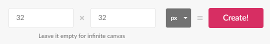

3. Click **Create**

- At this point you can zoom in to make the canvas fill the screen

4. In the top toolbar, select the shapes dropdown and select "Polygon"
   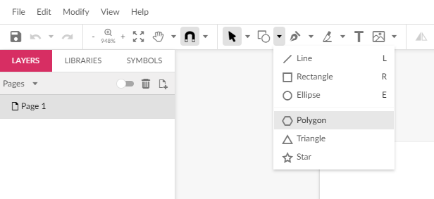

5. Drag a shape onto your canvas.

- You can always resize and rotate later, but I like to use shift while dragging to create a flat bottom as the baseline.
- Using the **align center** and **align middle** buttons, you can easily center your design on the page
  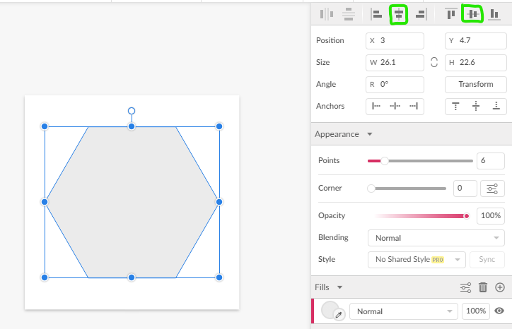

6. You can adjust the number of points and how round your corners are under the "Appearance Panel" - I'll be using **6** Points and **1** corner roundness
   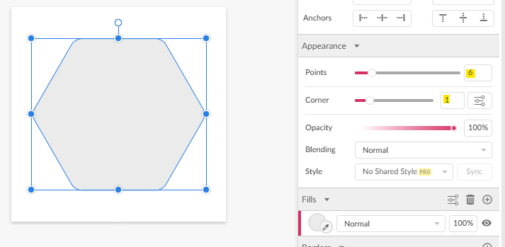

7. Click the fill bubble and change the fill type from **Color Fill** to **Linear Gradient**.
   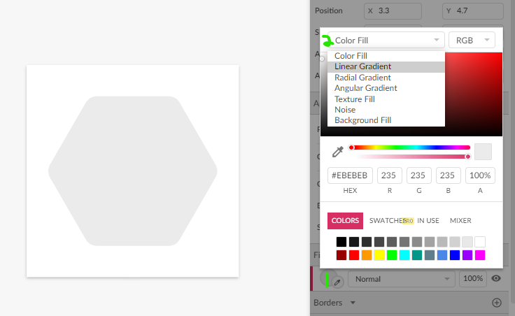

- You can change the colors of the gradient by clicking the dots on the grid or the rectangles under the fill type dropdown. For inspiration, you can check my [Gradient color picker site](gradients.terabytetiger.com)!
- You can adjust the direction of the gradient by dragging the dot endpoints on your canvas to get your look _just right_.
  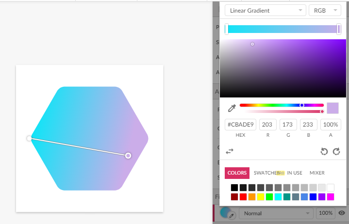

8. Click off of your shape - this will give you access to the page's attributes.
9. Change the color fill of the page to transparent by dragging the bottom slider (Opacity slider) under the color picker all the way to the left.

- This will make the background blend with the tab color regardless of what color theme someone is using. Before setting to transparent, I recommend checking what your icon looks like on default tab colors `#f3f3f3` and `#3B3B3B`.
  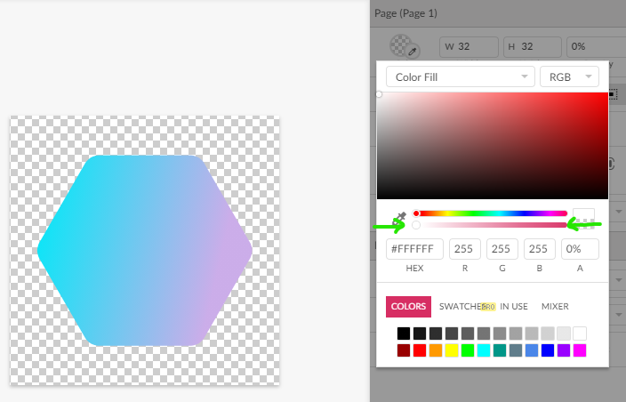

10. Click `File` > `Export` > `PNG Image`
    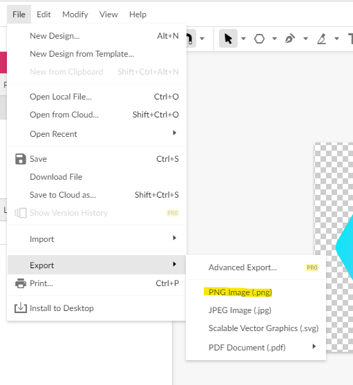

Awesomesauce - We have our 32x32 favicon! ✨

### Resizing 🔀

So now that we have our 32px favicon, how do we resize it to [other favicon sizes](https://gist.github.com/leommoore/6415005)? Well, Gravit makes that a 5 step process!

1. Resize your page to the newly desired size.

- Note the percentage ratio of your new size relative to 32 ({new size}/32 \* 100)% - for 16px this is 50%
  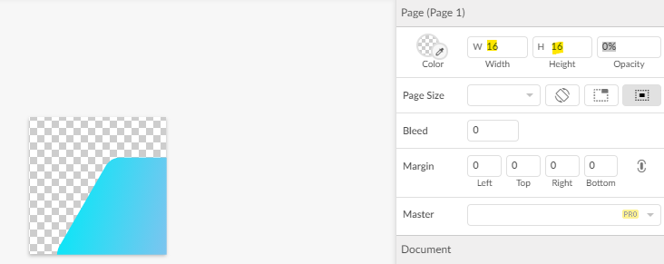

2. `Ctrl + a` to select everything

3. Click **Transform** under the position/alignment attributes

4. Set the **Scale** values to your calculation from step 1 (**50** for 16)
   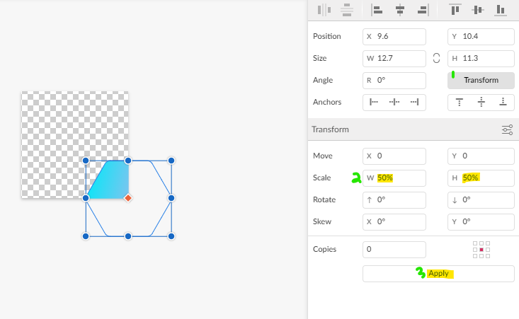

5. Click **Apply** and re-center your icon on your canvas
   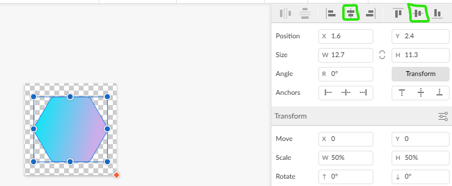

And now you're ready to export your new size!

## Made a favicon? Let me see it! 🎉

If you made a favicon with this process, [tweet at me](https://twitter.com/TerabyteTiger) with your image and where you're using it! I'd love to see what you made! 💕
