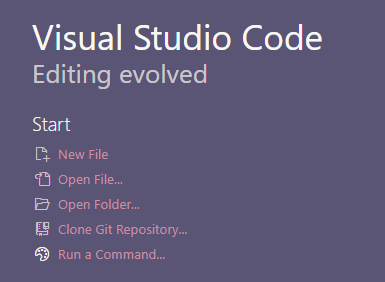
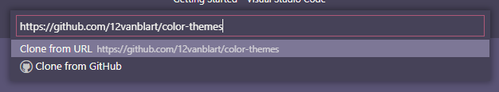
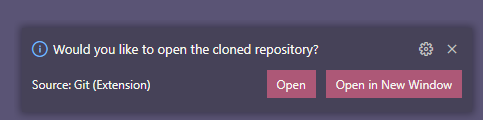
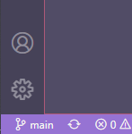
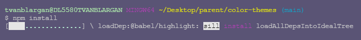
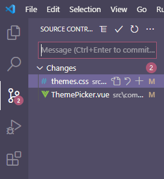
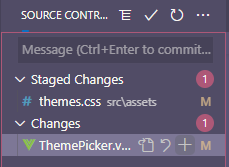
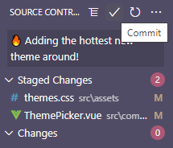
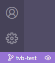
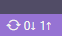

## Introduction

While my [earlier post](https://dev.to/terabytetiger/make-your-first-pull-request-3iai) outlines pushing commits using the terminal, since writing that article I have largely stopped using my terminal for pushing commits and do so directly in VS Code's git panel! Since I find pushing changes within VS Code easier, I decided to write a companion piece outlining how to commit to git from visual studio code!

> A handful of steps from this article will be very similar to part 2 of the series, but this time around we will be doing as much as possible via VS Code!

## Prerequisites

-   [Install git](https://git-scm.com/downloads)
-   [VS Code installed](https://code.visualstudio.com/download)
-   [A GitHub account](https://github.com/)

## Setup

1. Navigate your browser to [https://github.com/12vanblart/color-themes](https://github.com/12vanblart/color-themes)
2. Click the "Fork" button in the top right
   
3. Once Github is done forking the repository, click the "Clone or Download" button and copy the url in the dialog box.
   
4. Open a new VS Code Window
5. You should see an option on the "Getting Started" page that opens by default called "Clone Git Repository" - click this!
   
6. Enter the URL copied in step 3 into the prompt that is now at the top of your screen and press enter
   
7. This will open a File Explorer window - navigate to a folder where you would like this project to be saved. A folder called 'color-themes' will be created with the files from your repository in the selected folder.
8. Once you select a folder, a notification in VS Code will prompt you asking if you'd like to open the repository - you can click "Open" or "Open in New Window" to jump to the repository.
   

9. Now we'll create your branch by clicking in the bottom left of VS Code where it says "main" and a prompt will appear at the top of the screen. Type in the name you'd like for your branch and click "Create New Branch"
   

10) Open the integrated terminal in VS Code under the Ribbon > Terminal > New Terminal and run the command `npm install` to install the packages needed to test running the service. > In the past I've had issues with the VS Code Terminal not opening while [Hyper](https://hyper.is/) was installed - if you have Hyper installed you may need to navigate to the directory and run these commands via Hyper.
    
11) Once `npm install` completes, run `npm run serve` to start a local copy of the app. You can stop the local server at any point with <kbd>Ctrl</kbd> + <kbd>C</kbd> and answering `y` to "Would you like to terminate the batch job?"
12) Open your web browser of choice and navigate to `localhost:8080`!

At this point you should see the same thing as on [themes.tvanblargan.com](https://themes.tvanblargan.com).

## Adding a theme

There are two files that you will need to update to add a new theme - `src/assets/themes.css` and `src/components/ThemePicker.vue`. These files were created when you used the `git clone` command above. Don't worry if you don't know any Vue, the changes you need to make to that file won't be anything too intense!

### Editing ThemePicker.vue

In this file, you'll see a list of `<Theme>` components starting on line 28. Add a new line after all existing `<Theme>`'s as follows:

```vue
<Theme
    theme-name="your-theme-name"
    display-name="Your Theme Name"
    contributor="githubUsername"
/>
```

replacing `your-theme-name` with the class name (see Editing themes.css below), `Your Theme Name` with whatever you want your theme's name to display as on the option list, and `githubUsername` with your Github username.

### Editing themes.css

On line 15, you'll want to copy in the following (make sure your theme is at the top of the file after the comments end):

```css
.your-theme-name {
    --primary: #fff;
    --secondary: #fff;
    --accent: #fff;
    --link: #fff;
    --text: #fff;
}
```

You'll update `your-theme-name` to be whatever you want your theme's class to be called (check that there isn't already a theme with your chosen name!).

Next, update the `#fff`'s to be your colors of choice. If you're not sure where to start picking colors, I recommend playing around with [Pallettte](https://palettte.app/)

_Once you select your theme, saving themes.css will update localhost instantly without needing to reselect your new theme!_

### Requirements for accepted PR's

Note that each time a theme is selected, the `A11y` card's values are recalculated and updated to reflect the contrast ratio between various theme colors. In order for your theme to be approved, each of these numbers needs to be greater than or equal to 4.5 (WCAG AA Compliant).

## Committing your changes

Once you're happy with your theme and it's passing the contrast requirements, you'll want to save your changes so they can be added to the live site and everyone can see your awesome theme!

To do this, open the git panel in VS Code:


You should see both `themes.css` and `ThemePicker.vue` listed under the heading "Changes". This shows you any files that have been modified since the last commit to the file. As you hover over each of the items there will be a "+" Icon to stage the changes, and a "undo arrow" to discard the changes. Click the "+" icon for both items so they move to the "Staged Changes" Header.



Once both files are staged, we'll add a commit message in the input box above the "Staged Changes" header. Once entered, either press <kbd>Ctrl</kbd> + <kbd>Enter</kbd> or the checkmark above the input box to commit your changes!


After processing for a moment, you'll see the files disappear from the list - this means your changes are committed! Time to send them to the cloud by clicking the Cloud Publish icon in the bottom left next to where it shows your branch name!



Once clicked, 2 syncing arrows will spin for a bit, then you'll be able to hop over to GitHub and see the changes live!

Note: After the first publish instead of showing the publish cloud icon, VS Code will show you a number next to a down arrow and a number next to an up arrow - this indicates the number of commits to be pulled from GitHub/pushed to Github and clicking either will sync your local repository with the online repository!



> The rest of this article will be the same as [Part 2](https://dev.to/terabytetiger/make-your-first-pull-request-3iai) of this series

## Making the Pull Request!

Now head to [github.com](https://github.com/) and navigate to your forked repository (github.com/yourUserName/color-themes) and select the "Pull Requests" tab, then push the "New Pull request" button.

1. Once the page loads, you'll want to make sure the dropdowns on the left are `base repository: 12vanblart/color-themes` and `base: main` and the options selected on the right are `head repository: yourUserName/color-themes` and `compare: yourBranchName`.
   
2. Click "Create Pull Request" and fill in the details
   
3. Click "Create Pull Request" to submit your theme for review!

## Done!

And just like that you're done! You've pulled a git repository from GitHub, updated the code, committed the code with git via VS Code, pushed the code to GitHub, and created a shiny new Pull Request!
