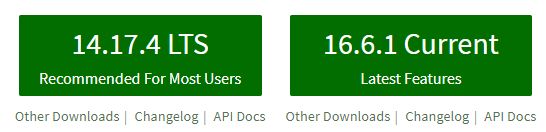

## What is node package manager?

A common phrase in development is "Don't reinvent the wheel", meaning don't spent a ton of time creating functionality that exists out of the box (Who hasn't spent hours to create their own time system instead of just using `Date()`? Not just me... right?). Although it can be a great learning experience, when it comes to building production code, it can often be much less effort to stand on the shoulders of giants and leverage code written by others.

Long story short, node package manager (npm) is a way to install "packages of code" written by someone else that you can then use in your project. You may be asking yourself, "Why don't I just copy their code into a file? Why do I need npm to do this?". There are a few advantages to using npm over copying the code, including that you don't have to figure out what code their project is dependent on to run, and if there's ever a security issue with an npm package, you can easily update the package!

And the best part of npm? It comes with [Node](https://nodejs.org/en/)! So if you already have Node installed you (most likely) already have npm!

## npm installation

### How do I know if I already have npm installed?

From the command line, you can check if npm is already installed by running:

```bash{codeTitle: "Terminal"}
npm --version

# Expected output to be something like
6.14.10
# If this number doesn't match up, that's OK!
```

_Note: This can be run from any directory, it doesn't need to be a node project folder!_

### What if I don't have npm installed?

If running `npm --version` returned an error along the lines of:

```bash{codeTitle: "Terminal"}
npm: The term 'npm' is not recognized as a name of a cmdlet, function, script file, or executable program. Check the spelling of the name, or if a path was included, verify that the path is correct and tray again.
# This is the powershell error format. CMD or bash might have slightly different error messages.
```

Don't fret! You can install Node/npm from the [Node.js homepage](https://nodejs.org/en/) by selecting either the "LTS" (Long term support) build or the "Current" build, which may be less stable but offers the latest feature set.



Once you download and install the package, try running `npm --version` as shown above and you should see a version returned. The version of npm will not match the version of node you downloaded - npm has separate version releases. You may need to restart your terminal if you still have it open from earlier.

## Enter package.json

Now that we have npm installed, we can dig a bit more into how it works and how it will impact projects you're working on.

When working with Node projects or frameworks such as [Vue](https://vuejs.org/) or [React](https://reactjs.org/) you'll run into package.json files (unless you're importing React/Vue via CDN). The package.json file is used for npm to be able to understand what packages you'd like to use in your project in the `dependencies` and `devDependencies` portions:

```json{codeTitle: "package.json"}
// These are the dependencies for my blog
// at the time of writing
{
  //...
  "dependencies": {
    "@fortawesome/free-regular-svg-icons": "^5.13.1",
    "@fortawesome/free-solid-svg-icons": "^5.13.1",
    "@gridsome/plugin-critical": "^0.1.6",
    "@gridsome/plugin-sitemap": "^0.4.0",
    "@gridsome/source-contentful": "^0.5.3",
    "@gridsome/source-filesystem": "^0.6.2",
    "@gridsome/transformer-remark": "^0.3.2",
    "@tailwindcss/typography": "^0.4.1",
    "autoprefixer": "^9",
    "dayjs": "^1.10.5",
    "gridsome": "^0.7.17",
    "gridsome-plugin-remark-prismjs-all": "^0.3.5",
    "postcss": "^7",
    "remark-footnotes": "2.0.0",
    "tailwindcss": "npm:@tailwindcss/postcss7-compat",
    "webpack-bundle-analyzer": "^4.4.2"
  },
  "devDependencies": {
    "@fortawesome/fontawesome-svg-core": "^1.2.29",
    "@fortawesome/free-brands-svg-icons": "^5.13.1",
    "@fortawesome/vue-fontawesome": "^0.1.10",
    "@fullhuman/postcss-purgecss": "^2.3.0",
    "gridsome-plugin-remark-codetitle": "^0.2.2"
  }
}
```

## npm install

**Note: `npm install` and `npm i` are interchangeable - they both do the same thing!**

Notably, when you first clone an npm dependent repository you won't be able to immediately start the project - at least not without errors! The first thing you'll need to do is run `npm install`, which will read through the dependencies of your package.json file and install the packages (and their dependencies). This sometimes takes a bit to run, so don't worry if it feels like it is taking forever to run.

After the install command finishes running, you may notice that a new file can be found in your directory - package-lock.json.

## What is this "found 1321 vulnerabilities" message?

Sometimes when you run `npm install` at the end you'll see a message that looks a little like this at the end:

```bash{codeTitle: "Terminal"}
found 1321 vulnerabilities (116 low, 246 moderate, 958 high, 1 critical) in 2040 scanned packages
  run `npm audit fix` to fix 1093 of them.
# Yes, this was for one of my actual repositories 😅
```

When `npm install` runs, npm also runs `npm audit`, which checks the npm records for any packages that have been updated to fix a known security vulnerability. Sometimes this will involve manual intervention to fix, but sometimes npm can fix it for you if you run `npm audit fix` depending on what your version settings are (more on this below).

## What's this new package-lock.json file?

package-lock.json is a file that is autogenerated by npm to outline exact versions of the npm packages that were installed. This is important to help avoid the following situation:

1. You begin working on a project using npm-package version 1.0
1. You upload your repository to GitHub
1. Some time later, npm-package version 2.0 is published with breaking changes
1. Someone tries to clone your repository
1. When they run `npm install` they install version 2.0 and the repository throws errors when they try to run it.
1. Panik ensues

Thanks to package-lock.json, when the user runs `npm install`, it will install the same versions of the packages that you were using when you developed the project! No panik!

## Adding packages to your project

In the documentation for npm packages that you would use in your project, you'll (usually) see a line about how to install the package. The installation follows this pattern:

```bash{codeTitle: "Terminal"}
npm install packageName
```

Where `packageName` is replaced by the name of the npm package you wish to install. You can also chain packages together to install them all at once:

```bash{codeTitle: "Terminal"}
npm install package1 package2 package3
```

The above command will install "package1", "package2", and "package3"!

Whenever you add a package, the normal `npm install` will also run to ensure all packages are installed.

### Specifying versions

Notably, there are different ways to specify versions in package.json. Some of the most common examples I see:

```json{codeTitle: "package.json"}
{
  //...
  "dependencies": {
    "specific": "1.0.3",
    "tilde": "~1.2.0",
    "caret": "^1.0.0"
  }
  //...
}
```

-   specific will install exactly version 1.0.3
-   tilde will install any patches to the minor version. In other words, the third decimal can change, but 1.3.0 will not be installed.
-   caret will install minor changes and patches. In other words, the second and third decimal can change, but 2.0.0 will not be installed.

These are all useful for different situations - but that's a post for another day!

## If I installed the node modules, why does the next person to use my project need to run `npm install`?

Remember the bit where I said running `npm install` can take a while to run? That's because the packages are being downloaded and installed to your repository. When working with node modules, it is common practice to include the following in a .gitignore file in the root of your project:

```txt{codeTitle: ".gitignore"}
node_modules
```

This will prevent your node_modules from uploading with your project, saving you time each time you push your repository (and keeping your git tree less cluttered).

## dependencies vs devDependencies

**This section is mostly for the curious and for those that are looking to publish npm packages. It's okay to skip this section. 👍**

When working on a project, it is common to include a testing framework such as [Jest](https://jestjs.io/), but since the testing happens on the developer side, you don't necessarily want to make everyone that uses your package in the future to install Jest. When a package is only needed for local development instead of the normal install command, you'll see `npm install --save-dev packageName`, which saves the package to the `"devDependencies"` object, and saves your users from waiting to install a package they don't really need.

Note that someone working on the repository where you have devDependencies will still install the associated packages since they're working on your package, not using it in another repository. Because of this, building projects with something like Vue or React will functionally see no difference between dependencies and devDependencies (again - unless you're building something like a component to be used by other developers).

## npm global installations

When working with npm packages, you may also run into the `--global` flag, which will _not_ install the package to the repository you are currently in. Instead, this flag will install the package in a way where you can run the package from the command line later.

For example, if you were trying to install the [Vue CLI (Command line interface)](https://cli.vuejs.org/) you would run:

```bash{codeTitle: "Terminal"}
npm install --global @vue/cli
```

which enables commands such as

```bash{codeTitle: "Terminal"}
# Create a new Vue Project:
vue create project

# And

# Adding plugins to vue projects (in this case ES Lint):
vue add eslint
```

By extension, the global functionality also allows you to create your own command line interface prompts and tools to do things from the terminal!

## Why do npm install instructions also refer to yarn?

Just a quick note about `yarn add` commands - [Yarn](https://yarnpkg.com/) is built on top of npm and offers the same functionality via slightly modified commands. For example:

```bash{codeTitle: "Terminal"}
# Instead of npm install package
yarn add package

# Instead of npm install
yarn
```
