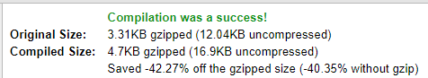

If you want to try my game, you can play it at [spacebar.terabytetiger.com](https://spacebar.terabytetiger.com) - and yes, it works on mobile too! 🥳

## Background (The Planning phase)

### What is js13kGames

js13kGames is an annual game jam creating games for the web with the interesting restriction of limiting zipped file size to a lowly 13 kB.

> Why exactly 13 kB?
> Well... why not? :)

Source: [js13kGames](https://js13kgames.com/)

This creates a few interesting challenges compared to my day-to-day development work, namely **No JS Frameworks**. Even if you can fit your normal framework into the limit, chances are that it will be using such a large portion of your 13 kB that it isn't worthwhile. Nothing like going without your favorite framework for a week to find out how much you rely on those "little" things they do for you.

### Why js13k for my first game

Being my first time developing a game, I knew I wanted it to be (relatively) simple, so I started thinking up how to make something along the lines of one of my favorite online childhood games - [Lemonade Stand](https://www.coolmathgames.com/0-lemonade-stand). Thanks to the 13kB limit, I knew going in that keeping a narrow scope would both be helpful to ensuring it was a manageable development effort as well as helping keep me in the requirements of the game jam.

Then the theme was announced: **SPACE**

I don't know what hit me, but I knew from the moment I saw the theme that I needed to do either a Spacebar themed game serving things to other keys from across the keyboard, or a Space Bar themed game serving the wildest drinks in the galaxy to the folks travelling through space.

Then I busted out my trusty catchphrase: "Por que no los dos?!" and Spacebar's Space Bar was born.

With the bare minimum of a plan and a name to go off of, I was ready to create the galaxy's next big hit!

## Challenges (The Development/I miss Vue phase)

### What even is vanilla HTML/CSS/JS?

To say it's been a while since writing vanilla HTML/CSS/JS would be an understatement (I don't think I've ever made a website that had more than a few lines of JS without a framework before this 😅). I was still able to use some of the approaches similar to Vue - such as the first line of JS being `let state = {}`

### Who needs components/modules?

This is a self-imposed problem, but the base of Spacebar's Space Bar is written in 3 files:

1. game.html
1. main.css
1. game.js

While this was great initially, it certainly led to some unruly and very long files sooner than later in the development process. The biggest indicator that my files were starting to get out of hand was when I found 3 instances of `button {}` in my CSS file 🤪.

### I have 0.333333333333 dollars

I'll let the comment that's still in my game.js file speak for itself here:

```js
// Store money (and prices) in whole numbers
// because js decimals are tired
```

If you haven't run into floating point rounding issues before, it's a good thing to look up and be aware of/prepared for. Initially I was planning to include cents/decimals in the game, but I quickly realized I didn't want to deal with that hassle and started using whole numbers only.

### PNG files are kinda large actually

This issue really bugged me, but also it's less of a "bug" and more of a frustration. Because of the file size limit, I can't include the nice high quality favicon/social images I normally do. This doesn't really impact the experience within the game, but I assume I'm doing something suboptimal since others seem to have room for images in their games and I couldn't fit a single png file - so if you're reading this and know how to help, please reach out and let me know what I'm doing wrong here🙏🏻

### We're off to see the wizard, the wonderful wizard of minification

The final "blocker" I ran into was when it came to the bundling and minification of my game.

_My interpretation of how Minification was going to go:_ Candy falls from the sky and Unicorns frolic about as my files magically shrink down to <1kB each with the use of a single npm command 🦄🍬🦄🍭

_What actually happened:_ Every step like like stepping on a rake cartoon style. Happiness is nowhere to be found. My file sizes **INCREASED** when compiled.



That's right - ya boi is better at writing compiled code than the computer is 🤪.

While I was expecting there to be an abundance of minification packages available to me, it turns out there's not really any (that I could find) to roll up HTML, CSS, and JS into more compact files and React & Vue have been doing significantly more heavy lifting than I ever expected.

The biggest issue here was that each minification package would work on 1-2 of the 3, meaning that I was really hurting because I had included some `onclick` function calls directly in my HTML file, so even when I did find a good minification for JS, it just broke half the buttons.

Thankfully my files were small enough that condensing them with terser, csso, and html-minifier was enough to keep me under the file size limit 🎉.

## Wrap-up (The Fun phase)

### Playtime

As mentioned above, I was building this game to be similar to a favorite from my childhood, so once I had things working, it was a ton of fun to test it out and try to pay off my debt in the least amount of time possible. Once I was happy enough with the game, I had my wife, sister, brother, and a few friends try the game to provide feedback, and it was absolutely delightful getting to watch them discover how the game worked, especially if it was after a major game logic change.

### A crumbling and desolate economy

Behind the scenes look - this is how the prices change daily within the game (run for each item):

```js
function updatePricing(item) {
    // Randomly update the pricing of the passed in item - each day the items will randomly change in price from -33% - +35% rounded to an integer.
    const percentile = Math.min(Math.random() - 0.33, 0.35);
    state.ingredients[item].price = Math.max(
        state.ingredients[item].price +
            Math.round(state.ingredients[item].price * percentile),
        2
    );
    document.querySelector(
        `#buy-${item}`
    ).innerHTML = `Buy 1 ${state.ingredients[item].label} ($${state.ingredients[item].price})`;
    return state.ingredients[item].price;
}
```

This function takes the current price of the item and bumps it up/down by -33 -> 35% randomly each day. I think this works roughly as intended now, but initially I had the lower limit at something like -50%, but only could increase by 25%. If the random number was higher than 25%, it would drop to a 25% increase (same with the new logic but at 35%). Combine this with the desire to not include decimals and suddenly the prices almost never were increasing, but would quickly plummet toward the \$2 lower limit.

This didn't _break_ the game, but did make for a very unfun play experience where until an item was at \$2, it was not worth purchasing, and meant that profit margins were extra slim.

## Conclusion

Thanks for following along on the ups and downs of my first game jam 🥳 It was a very educational experience and I certainly appreciate how helpful frameworks are since creating Spacebar's Space bar. If you play the game, I look forward to seeing your score shared on Twitter!

If you're interested in seeing the spaghetti that runs Spacebar's Space Bar: [Click here](https://github.com/TerabyteTiger/spacebar-space-bar)

And if you're using [Coil](https://coil.com) you can gain a little extra control and set the game rules however you'd like 😉
