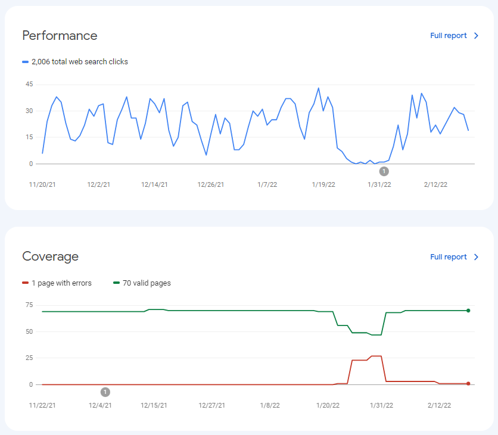

During [my migration from Gridsome to Nuxt](https://terabytetiger.com/lessons/migrate-from-gridsome-to-nuxt) I mentioned that I was having issues getting the `deep:true` part of the [Nuxt Context module](https://content.nuxtjs.org/) working, and took The Lazy Dev™ approach and just didn't use it, essentially flattening my directory structure. Unfortunately, this led to the shortening of my blog posts URLs, which has consequences when [Google Search Console](https://search.google.com/search-console/about) suddenly thinks the pages are gone!



Thankfully, all that was required was to add redirects from my old (and now broken) links to the correct URLs. However, I didn't want to create and maintain a growing list of post redirects since one of the reasons for migrating to [Nuxt](https://nuxtjs.org/) was to decrease my number of steps required to go from draft to posted.

## Enter Netlify Redirects

After my poking around Google Search Console for a bit to figure out what was happening, I realized that when I removed the article subdirectory from the content directory, I had in fact updated all of the blog post URLs, removing the `articles/` from my old URLs. To fix this, I needed a way to tell Google that any urls that started with `TerabyteTiger.com/lessons/articles/postName` needed to map to `TerabyteTiger.com/lessons/postName`.

### Create `_redirects` in `static/`

To begin fixing this issue, we need to create a file called `_redirects` - Note that there is no file extension! This will need to remain intact after running our build process, so we want this to be located in our `static/` directory.

> Create a file called `_redirects` - Note that there is no file extension!

### Add URLs to remap

Once we create our `_redirects` file, we'll add our first column - the URLs to remap. For me this looked like this:

```plaintext{codeTitle: "_redirects"}
/lessons/articles/*
/blog/*
```

`/blog/` was an old url pattern, but I figured might as well catch those as well. Note that at the end of these, there is a `*` to indicate that we still want to catch anything that meets this pattern, even if it has additional characters following the last `/`.

### Add `:splat` redirects

Now we'll add a tab or two at the end of each line and follow that with the new URL to direct to.

```plaintext{codeTitle: "_redirects"}
/lessons/articles/*     /lessons/:splat
/blog/*                 /lessons
```

On the first line, you'll notice we're using `:splat` - this will return everything that was caught by the `*` in our first column, so `/lessons/articles/myBlogPost` will become `/lessons/myBlogPost` and `/lessons/articles/2022/postName` will become `/lessons/2022/postName`.

A few days after publishing these updates, my Search Console was back to normal 🎉

For more information see [Netlify's Redirects and Rewrites docs](https://docs.netlify.com/routing/redirects/)!
