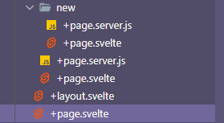

## Background

I've been working with Vue (mostly 2 with a bit of 3 mixed in recently) at work for ~5 years now, and since we're starting to evaluate things like migrating to Vue 3 I knew when this small project came across my desk it would be the perfect opportunity to dip my toes in Svelte.

I mostly followed the [interactive tutorial from SvelteKit](https://learn.svelte.dev/tutorial/welcome-to-svelte) with modifications to match what I needed.

## What I built

The app I built was to function as the admin side of a URL shortener (something like [bit.ly](https://bitly.com/)) so that one of our teams can convert long bookmarks into more shareable links so we can generate QR codes that another department on our team would use in their day-to-day tasks.

This is a very straightforward small app, and only took me about 1 day's work to squeeze it in between the other things I do during the day.

## What I liked

### JS/HTML split files

As someone that really likes Vue 2, it won't be a surprise that I liked the split of HTML and JS being completely disjoined into 2 files - although having to include a script to access the `data` seems like something that should be automatically happening.

### HTML `#each`

I liked the `#each` approach to looping HTML elements - I think it's a bit more obvious what's happening than how Vue uses `v-for`.

```svelte
{#each data.allUrlDocs.rows as { doc }}
	<li><a href="/url/{doc._id}">{doc._id}</a></li>
{/each}
```

## What I didn't like

### File Names

Regardless of how nice the development experience was, my biggest gripe with Svelte is the singular reason I won't be using it in the future - the file naming structure is painfully bad.

Using the folders as a way to include the routing auto-magically is great - but then having to stuff every folder with `+page.server.js` and `+page.svelte` immediately leads to confusion regarding which file is which. Having to read the subfolder names from these tabs had me pulling my hair out:


And having to collapse/open folder in order to figure out which `+page.svelte` I was actually trying to open was constantly breaking my concentration.



### Build/Deploy Process

For our internal apps, we use IIS to deploy our apps locally on our network. Svelte seems like it'd be a delight to use if using a tool like Netlify, but for local deploys the process seems needlessly complicated.

I know us using IIS made this even more complicated than it needed to be, but compared to the tutorial docs which were clear and easy to follow, the build docs and terminal output were very confusing about what exactly `yarn build` was doing.
