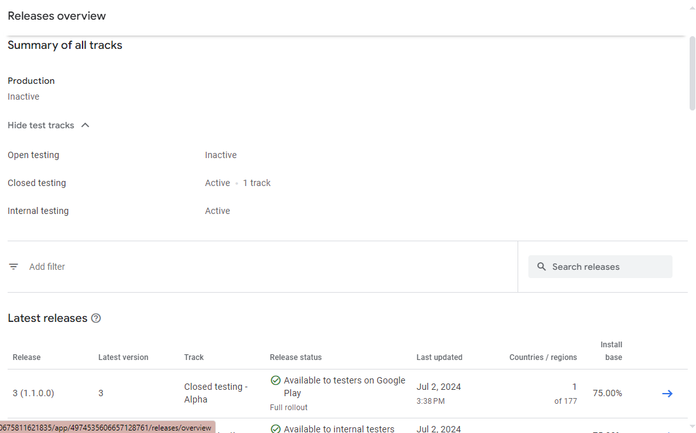

_This post is not sponsored, and I am not an affiliate_

Something that's long been on my bucket list as a developer has been to publish an Android app on the Play Store. While I've never had a concrete idea for what I wanted to the app to do, I've taken some time working through the beginner tutorials for Kotlin, Flutter, NativeScript, and React Native.

But as I've found to often be the case, the solution will come to me while solving a problem for myself.

## The "Problem"

If you're a frequent Instagram user, you've probably seen the seamless carousel posts where a single panorama is broken apart into multiple images in the 1:1 square aspect ratio that Instagram uses so that as you swipe through it the panorama flows from image to image.

While there are multiple apps out there that can do this, I found them to be rather polluted with ads and tended to favor more artistic approaches that involved multiple images with additional templating and styling applied.

So I did a Pro Developer Move™ - built something over the course of multiple days instead of sitting through 45 seconds of ads!

## The Solution

The how isn't particularly important to this story, but the TL;DD (Too long; Didn't Develop) is: I dropped [this cropper component](https://advanced-cropper.github.io/vue-advanced-cropper/) into the page with a second invisible cropper that does some math to generate the images for the user in the background. [Github](https://github.com/TerabyteTiger/swipeypanorama)

So I had my app, [Swipey Panorama](https://swipeypanorama.terabytetiger.com/) and deployed the website for a few friends to take a test drive with and after getting the thumbs up that it seemed to be working, started phase 2 of my master plan - adding Progressive Web App (PWA) support so I could install the site on my phone for easy use.

## Finding Treasure

While refreshing myself on what exactly had to go into the `manifest.json` and service worker files, I stumbled upon [PWA Builder](https://www.pwabuilder.com/) - which happened to include a section about deploying a PWA to various app stores! Could it be this simple? Just a few clicks and I could have an app?

Well, yes ... but also no.

_Generating_ the app/files would in fact be rather simple. _Publishing_ the app/files to the app store would not be quite as simple as the single button press that was needed to generate the files.

## Lost! In the Play Store Developer Console!

As someone who has used google.com before and would describe the experience as about as simple as it gets - The Play Store Developer Console is the exact opposite experience. There are quite a few pages that require your attention to get your app set up, and none of them link to each other (as far as I could tell at least).

But I was determined and despite the most user-unfriendly experience I think I've ever had, I eventually had everything set up and was left with "Deploy your first release" with a link that took me to the Releases overview page:

After searching this page up and down multiple times, eventually I somehow found my say to the App Bundle Explorer - which is where you can actually upload a new release version. It took less time to figure this part out - but you upload the App bundle (`.aab` file, not `.apk` - which can be used to install the app on a local device).

## Updating your app

Just when I thought I had everything rolling, one of my testers immediately found a bug (which I was vaguely aware could happen, but I thought it was going to be limited to PC users and could just fix after the fact). I made the fixes, deployed the website, and rebuilt the package to upload to the Play store. After getting what I think was every possible error - here's a list of items that you need in order to make updates to your app:

-   The `Version Code` needs to be set to a unique number on the PWA Builder screen
-   The `Version Name` needs to be different
-   Your `Signing Key Info` needs to match - This can be found in the `signing-key-info.txt` file that's downloaded when you first build your app. You also need the `signing.keystore` file to upload to PWA Builder.

Once uploaded and reviewed, you'll be able to deploy the updates to your Testing/Production release.

## Test out Swipey Panorama:

Website: https://swipeypanorama.terabytetiger.com/

