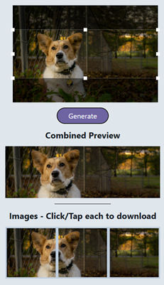
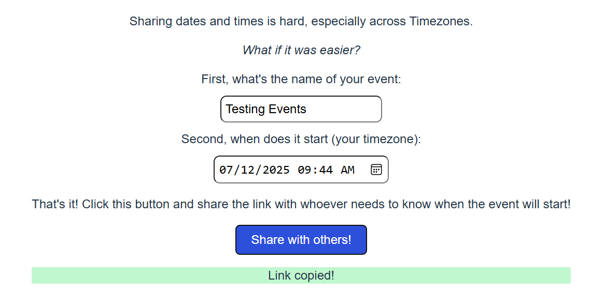

## Online Tools

### Swipey Panorama

Create Instagram Panoramas from a single image easily for free.
Works great on mobile!

[Web](https://swipeypanorama.terabytetiger.com/) | [Github](https://github.com/TerabyteTiger/swipeypanorama)

### Easy Timezone Share

Easiest way to share a start datetime. Enter the date/time your event starts and generate a link that will automatically show that time in the recipients timezone!

[Web](https://tz.terabytetiger.com/) | [Github](https://github.com/TerabyteTiger/tzconvert)

### Pokemon EV Tracker

EV Training Tracker w/ modifier options for those looking to be the very best.

[Web](https://ev.terabytetiger.com/) | [Github](https://github.com/TerabyteTiger/pokemon)

## Work Project Experience

### Safety Inicident Web App

-   A web-based data collection and trending app built with Vue.js.
-   Used regularly by over 350 users to keep track of injuries, investigate causes, and report OSHA DART rates.

### QA Incidents Web App

-   A web-based data collection and trending app built with Vue.js.
-   Utilized dynamic interfaces to display different input/view data by facility.
-   Used daily by over 100 users for tracking incidents and auditing fixes.

### Scangun Login App

-   Tied user logins to their badge to prevent password sharing and allow asset use tracking.
-   Allowed scangun login to ERP system via scanning a barcode instead of typing usernames/passwords.
-   Over 250,000 logins/logouts, 275 per day on average.
